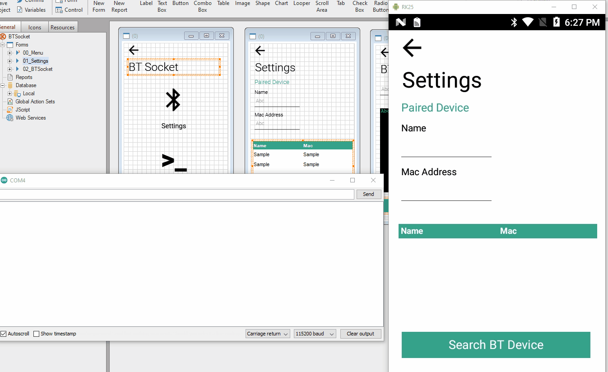

BT Socket

Simple project to send and receive text using sockets via Bluetooth.
An easy way to test this is using a Arduino or a ESP32 and a Sample that is already in the Arduino Development Platform.
Please read carfully this tutorial:
https://randomnerdtutorials.com/esp32-bluetooth-classic-arduino-ide/

Check the video:

##ESP32 / Arduino
My goal is not to explain how to use the ESP32/Arduino.
Please reade this Tutorial:
https://randomnerdtutorials.com/esp32-bluetooth-classic-arduino-ide/

##Kalipso
First select yout BT Device.
Then you can start sending messages from your Kalipso app to Arduino Serial Monitor.
And the other way arund.

