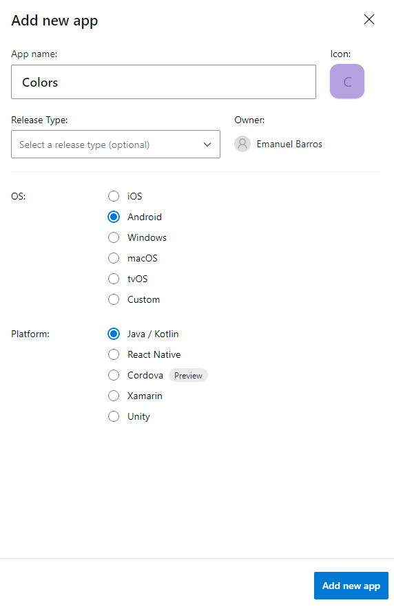
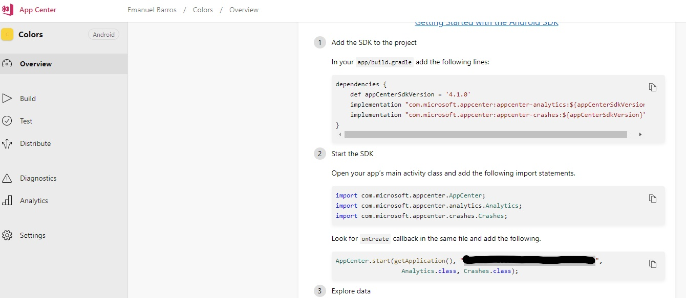
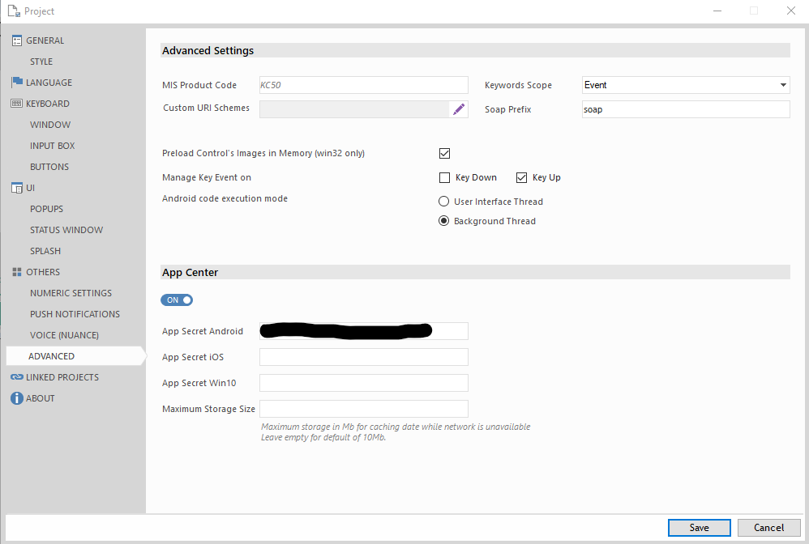
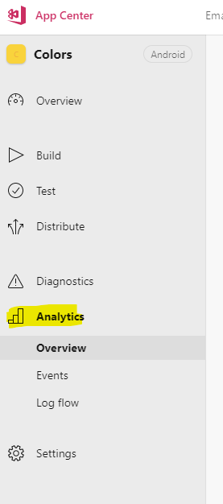

#Colors

The main goal of this sample is to demonstrate how to use App Center
appcenter.ms
You can also take a look to the Local Action Set to get random colors from http://colormind.io/.
I'm using HTTP Request and parsing JSON.
This is just to look nice ::):

## App Center
Please read carefully the APP Center documentation
https://appcenter.ms/

## Usage
* Create a new app in App Center

* Get the APP Secret

* Copy the APP Secret to Kalipso project properties

* Get some Results!

